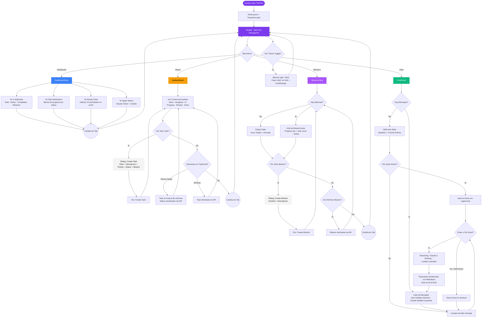

# TheHive - Leeto: Documento de Hand-off de Diseno

> **Fuente de Verdad** para el equipo de Producto y Diseno.
> Generado desde el codigo fuente el 2026-03-12.
> Framework: Next.js 15 + React 19 + Tailwind CSS 3.4 + Radix UI

---

## 1. Design Tokens (JSON)

Copiar directamente a Figma como variables de diseno.

```json
{
  "colors": {
    "light": {
      "background":           { "hsl": "0 0% 100%",        "hex": "#FFFFFF" },
      "foreground":           { "hsl": "240 10% 3.9%",     "hex": "#09090B" },
      "card":                 { "hsl": "0 0% 100%",        "hex": "#FFFFFF" },
      "card-foreground":      { "hsl": "240 10% 3.9%",     "hex": "#09090B" },
      "primary":              { "hsl": "262 83% 58%",      "hex": "#7C3AED" },
      "primary-foreground":   { "hsl": "0 0% 98%",         "hex": "#FAFAFA" },
      "secondary":            { "hsl": "240 4.8% 95.9%",   "hex": "#F4F4F5" },
      "secondary-foreground": { "hsl": "240 5.9% 10%",     "hex": "#18181B" },
      "muted":                { "hsl": "240 4.8% 95.9%",   "hex": "#F4F4F5" },
      "muted-foreground":     { "hsl": "240 3.8% 46.1%",   "hex": "#71717A" },
      "accent":               { "hsl": "240 4.8% 95.9%",   "hex": "#F4F4F5" },
      "accent-foreground":    { "hsl": "240 5.9% 10%",     "hex": "#18181B" },
      "destructive":          { "hsl": "0 84.2% 60.2%",    "hex": "#EF4444" },
      "destructive-foreground": { "hsl": "0 0% 98%",       "hex": "#FAFAFA" },
      "border":               { "hsl": "240 5.9% 90%",     "hex": "#E4E4E7" },
      "input":                { "hsl": "240 5.9% 90%",     "hex": "#E4E4E7" },
      "ring":                 { "hsl": "262 83% 58%",      "hex": "#7C3AED" }
    },
    "dark": {
      "background":           { "hsl": "240 10% 3.9%",     "hex": "#09090B" },
      "foreground":           { "hsl": "0 0% 98%",         "hex": "#FAFAFA" },
      "card":                 { "hsl": "240 10% 5.5%",     "hex": "#0F0F14" },
      "card-foreground":      { "hsl": "0 0% 98%",         "hex": "#FAFAFA" },
      "primary":              { "hsl": "262 83% 58%",      "hex": "#7C3AED" },
      "primary-foreground":   { "hsl": "0 0% 98%",         "hex": "#FAFAFA" },
      "secondary":            { "hsl": "240 3.7% 15.9%",   "hex": "#27272A" },
      "secondary-foreground": { "hsl": "0 0% 98%",         "hex": "#FAFAFA" },
      "muted":                { "hsl": "240 3.7% 15.9%",   "hex": "#27272A" },
      "muted-foreground":     { "hsl": "240 5% 64.9%",     "hex": "#A1A1AA" },
      "accent":               { "hsl": "240 3.7% 15.9%",   "hex": "#27272A" },
      "accent-foreground":    { "hsl": "0 0% 98%",         "hex": "#FAFAFA" },
      "destructive":          { "hsl": "0 62.8% 30.6%",    "hex": "#7F1D1D" },
      "destructive-foreground": { "hsl": "0 0% 98%",       "hex": "#FAFAFA" },
      "border":               { "hsl": "240 3.7% 15.9%",   "hex": "#27272A" },
      "input":                { "hsl": "240 3.7% 15.9%",   "hex": "#27272A" },
      "ring":                 { "hsl": "262 83% 58%",      "hex": "#7C3AED" }
    },
    "semantic": {
      "emerald-500":  "#10B981",
      "emerald-400":  "#34D399",
      "amber-500":    "#F59E0B",
      "amber-400":    "#FBBF24",
      "blue-500":     "#3B82F6",
      "blue-400":     "#60A5FA",
      "red-500":      "#EF4444",
      "purple-500":   "#A855F7",
      "slate-500":    "#64748B"
    }
  },
  "typography": {
    "fontFamily": "system-ui, -apple-system, BlinkMacSystemFont, 'Segoe UI', Roboto, sans-serif",
    "fontSmoothing": "antialiased",
    "sizes": {
      "xs":   { "rem": "0.75rem",  "px": "12px" },
      "sm":   { "rem": "0.875rem", "px": "14px" },
      "base": { "rem": "1rem",     "px": "16px" },
      "lg":   { "rem": "1.125rem", "px": "18px" },
      "xl":   { "rem": "1.25rem",  "px": "20px" },
      "3xl":  { "rem": "1.875rem", "px": "30px" }
    },
    "fontWeights": {
      "normal":   400,
      "medium":   500,
      "semibold": 600,
      "bold":     700
    },
    "tracking": {
      "tight": "-0.025em"
    }
  },
  "spacing": {
    "0.5":  { "rem": "0.125rem", "px": "2px" },
    "1":    { "rem": "0.25rem",  "px": "4px" },
    "1.5":  { "rem": "0.375rem", "px": "6px" },
    "2":    { "rem": "0.5rem",   "px": "8px" },
    "2.5":  { "rem": "0.625rem", "px": "10px" },
    "3":    { "rem": "0.75rem",  "px": "12px" },
    "4":    { "rem": "1rem",     "px": "16px" },
    "6":    { "rem": "1.5rem",   "px": "24px" },
    "8":    { "rem": "2rem",     "px": "32px" },
    "12":   { "rem": "3rem",     "px": "48px" }
  },
  "borderRadius": {
    "sm":   { "value": "calc(0.625rem - 4px)", "approx": "6px"  },
    "md":   { "value": "calc(0.625rem - 2px)", "approx": "8px"  },
    "lg":   { "value": "0.625rem",             "approx": "10px" },
    "xl":   { "value": "0.75rem",              "approx": "12px" },
    "2xl":  { "value": "1rem",                 "approx": "16px" },
    "full": { "value": "9999px",               "approx": "pill" }
  },
  "shadows": {
    "sm":      "0 1px 2px 0 rgb(0 0 0 / 0.05)",
    "default": "0 1px 3px 0 rgb(0 0 0 / 0.1), 0 1px 2px -1px rgb(0 0 0 / 0.1)",
    "md":      "0 4px 6px -1px rgb(0 0 0 / 0.1), 0 2px 4px -2px rgb(0 0 0 / 0.1)"
  },
  "effects": {
    "backdropBlur": "blur(4px)",
    "scrollbar": {
      "width":  "6px",
      "height": "6px",
      "track":  "transparent",
      "thumb":  "var(--border)"
    }
  },
  "breakpoints": {
    "sm":  "640px",
    "md":  "768px",
    "lg":  "1024px",
    "xl":  "1280px",
    "max-content": "1600px"
  }
}
```

---

## 2. Arbol de Componentes React/UI

### Estructura Global

```
<html lang="en">
  <body class="font-sans antialiased">
    <ThemeProvider>                          // Contexto: { theme, toggleTheme }
      <Home>                                // Estado: activeTab = "dashboard" | "board" | "missions" | "chat"
        <Header />                          // Barra superior fija
        <main>                              // max-w-[1600px], padding 24px
          <DashboardView />                 // Condicional: activeTab === "dashboard"
          <KanbanBoard />                   // Condicional: activeTab === "board"
          <MissionsView />                  // Condicional: activeTab === "missions"
          <ChatPanel />                     // Condicional: activeTab === "chat"
        </main>
      </Home>
    </ThemeProvider>
  </body>
</html>
```

---

### Pantalla 1: Header (Barra de Navegacion Superior)

**Archivo**: `src/components/header.tsx`
**Layout**: Sticky top, h-14, border-bottom, bg-card/50 + backdrop-blur

```
Header
  Props: { activeTab: string, onTabChange: (tab) => void }
  |
  +-- Logo Area (flex, gap-3)
  |     +-- <Hexagon />                    // Icono h-6 w-6, color primary
  |     +-- <h1> "TheHive"                 // text-lg, font-bold, tracking-tight
  |     +-- <span> "Mission Control"       // Badge pill: text-xs, bg-muted, rounded-full
  |
  +-- Nav Tabs (flex, gap-1)
  |     +-- <Button> "Dashboard"           // variant: secondary (activo) | ghost (inactivo), size: sm
  |     +-- <Button> "Board"
  |     +-- <Button> "Missions"
  |     +-- <Button> "Chat"
  |
  +-- Status Area (flex, gap-2)
        +-- <Activity /> + "Claude Online"  // Icono emerald h-3 w-3, text-xs muted
        +-- <Button> Moon/Sun              // variant: ghost, size: icon, toggle dark/light
```

---

### Pantalla 2: DashboardView

**Archivo**: `src/components/dashboard-view.tsx`
**Layout**: space-y-6 (24px vertical gap)

```
DashboardView
  Props: ninguno (datos via hooks internos)
  Hooks: useActivity(3000), fetch /api/stats cada 5s
  |
  +-- Stats Grid (grid 1col -> 2col@sm -> 4col@lg, gap-4)
  |     +-- StatCard x4
  |           Props: { label: string, value: number, icon: LucideIcon, color: string }
  |           - "Total Tasks"    | icon: LayoutDashboard | color: text-blue-500
  |           - "Active"         | icon: Zap             | color: text-amber-500
  |           - "Completed"      | icon: CheckCircle2    | color: text-emerald-500
  |           - "Missions"       | icon: Target          | color: text-purple-500
  |           Estructura interna:
  |             <Card>
  |               <CardContent p-4>
  |                 <p> label (text-sm, muted)
  |                 <p> value (text-3xl, font-bold)
  |                 <Icon> (h-8 w-8, opacity-80)
  |
  +-- Two-Column Grid (grid 1col -> 2col@lg, gap-6)
  |     |
  |     +-- Task Distribution Card
  |     |     <Card>
  |     |       <CardHeader> "Task Distribution" (text-base)
  |     |       <CardContent>
  |     |         +-- ProgressRow x5 (Inbox, Assigned, In Progress, Review, Done)
  |     |               Props: { label: string, count: number, percentage: number }
  |     |               - <span> label (text-sm)
  |     |               - <span> "count (pct%)" (text-sm, muted)
  |     |               - <div> barra h-2, bg-muted, fill bg-primary
  |     |
  |     +-- Activity Feed Card
  |           <Card>
  |             <CardHeader> <Clock/> "Recent Activity" (text-base)
  |             <CardContent> max-h-[300px], overflow-y-auto
  |               +-- ActivityEntry x15 max
  |                     Props: { id, type, message, created_at }
  |                     - Icono por tipo:
  |                         task_created      -> ListTodo (blue-500)
  |                         task_status_changed -> Zap (amber-500)
  |                         task_deleted       -> AlertTriangle (red-500)
  |                         mission_created    -> Target (purple-500)
  |                         mission_deleted    -> AlertTriangle (red-500)
  |                         chat_message       -> MessageSquare (emerald-500)
  |                     - <p> message (text-sm, truncate)
  |                     - <p> tiempo relativo (text-xs, muted)
  |
  +-- Agent Status Card
        <Card>
          <CardContent>
            +-- Agent Row (flex, p-3, rounded-lg, bg-muted/50)
                  +-- Avatar (h-10 w-10, rounded-full, bg-primary/10)
                  |     +-- <Hexagon/> (h-5 w-5, text-primary)
                  +-- Info
                  |     +-- "Claude" (font-medium) + <Badge variant="success"> "Online"
                  |     +-- Descripcion (text-sm, muted)
                  +-- Meta (text-right, text-sm, muted)
                        +-- "Model: Claude Sonnet"
                        +-- "Tasks assigned: N"
```

---

### Pantalla 3: KanbanBoard

**Archivo**: `src/components/kanban-board.tsx`
**Layout**: space-y-4

```
KanbanBoard
  Props: ninguno (datos via hooks internos)
  Hooks: useTasks(), useMissions()
  |
  +-- Page Header (flex, justify-between)
  |     +-- <h2> "Task Board" (text-lg, font-semibold)
  |     +-- <Dialog> "Create Task"
  |           Trigger: <Button size="sm"> <Plus/> "New Task"
  |           Content: CreateTaskDialog
  |             +-- <Input> "Task title"
  |             +-- <Textarea> "Description (optional)" rows=3
  |             +-- Selects Row (grid-cols-3, gap-2)
  |             |     +-- <Select> Priority: Low | Medium | High | Urgent
  |             |     +-- <Select> Status: Inbox | Assigned | In Progress | Review | Done
  |             |     +-- <Select> Mission: No Mission | [misiones dinamicas]
  |             +-- <Button> "Create Task" (w-full, disabled si titulo vacio)
  |
  +-- Kanban Grid (grid-cols-5, gap-3, min-h: calc(100vh - 14rem))
        +-- KanbanColumn x5
              Props: { id, label, color }
              Columnas:
                - Inbox       | color: bg-slate-500
                - Assigned    | color: bg-blue-500
                - In Progress | color: bg-amber-500
                - Review      | color: bg-purple-500
                - Done        | color: bg-emerald-500
              |
              +-- Column Header (flex, gap-2, mb-3)
              |     +-- Dot (h-2.5 w-2.5, rounded-full, [color])
              |     +-- <span> label (text-sm, font-medium)
              |     +-- <Badge variant="outline"> count (text-xs)
              |
              +-- Column Body (bg-muted/30, rounded-lg, p-1, min-h-[200px])
                    +-- TaskCard x N
                    |     Props: { task, colIndex, totalColumns, onMove, onDelete, missions }
                    |     task: { id, title, description, priority, status, assigned_agent,
                    |             mission_id, created_at }
                    |     <Card> (hover:shadow-md transition)
                    |       <CardContent p-3>
                    |         +-- Title Row
                    |         |     +-- <GripVertical/> (visible on hover)
                    |         |     +-- <p> title (text-sm, font-medium)
                    |         +-- <p> description (text-xs, muted, line-clamp-2)
                    |         +-- Badges Row (flex-wrap, gap-1.5)
                    |         |     +-- <Badge> priority (text-[10px])
                    |         |     |     Low    -> variant: secondary
                    |         |     |     Medium -> variant: info
                    |         |     |     High   -> variant: warning
                    |         |     |     Urgent -> variant: destructive
                    |         |     +-- <Badge variant="outline"> mission name (si aplica)
                    |         +-- Footer (border-t, flex, justify-between)
                    |         |     +-- <Bot/> + agent name (text-[10px], muted)
                    |         |     +-- tiempo relativo (text-[10px], muted)
                    |         +-- Actions (visible on hover, flex, gap-1)
                    |               +-- <Button ghost icon h-6 w-6> <ChevronLeft/>
                    |               +-- <Button ghost icon h-6 w-6> <ChevronRight/>
                    |               +-- <Button ghost icon h-6 w-6 destructive> <Trash2/>
                    |
                    +-- Empty State: "Drop tasks here" (text-xs, muted, centered h-20)
```

---

### Pantalla 4: MissionsView

**Archivo**: `src/components/missions-view.tsx`
**Layout**: space-y-4

```
MissionsView
  Props: ninguno
  Hooks: useMissions(), useTasks()
  |
  +-- Page Header (flex, justify-between)
  |     +-- <h2> "Missions" (text-lg, font-semibold)
  |     +-- <Dialog> "Create Mission"
  |           Trigger: <Button size="sm"> <Plus/> "New Mission"
  |           Content:
  |             +-- <Input> "Mission name"
  |             +-- <Textarea> "Description (optional)" rows=3
  |             +-- <Button> "Create Mission" (w-full)
  |
  +-- Empty State (si no hay misiones)
  |     <Card>
  |       <Target/> (h-10 w-10, opacity-50)
  |       <p> "No missions yet..."
  |
  +-- Missions Grid (grid 1col -> 2col@md -> 3col@lg, gap-4)
        +-- MissionCard x N
              Props derivados de: mission { id, name, description, status, created_at }
              Datos calculados: missionTasks[], doneTasks[], progress (%)
              |
              <Card class="group">
                +-- <CardHeader pb-2>
                |     +-- <Target/> (h-4 w-4, text-primary) + mission.name (text-base)
                |     +-- <Button ghost icon> <Trash2/> (visible on hover, destructive)
                |
                +-- <CardContent space-y-3>
                      +-- <p> description (text-sm, muted) -- si existe
                      +-- Progress Section
                      |     +-- "Progress" (text-xs, muted) + "N%" (font-medium)
                      |     +-- Barra h-2, bg-muted, fill bg-primary
                      +-- Footer (flex, justify-between, text-xs, muted)
                            +-- <CheckCircle2/> "done/total"
                            +-- <Badge> status: variant success (active) | secondary (otro)
                            +-- <Clock/> + tiempo relativo
```

---

### Pantalla 5: ChatPanel

**Archivo**: `src/components/chat-panel.tsx`
**Layout**: flex-col, h-[calc(100vh-8rem)]

```
ChatPanel
  Props: ninguno
  Hooks: useChat()
  |
  +-- Chat Header (flex, justify-between, mb-4)
  |     +-- <h2> "Chat with Claude" (text-lg, semibold)
  |     +-- <Badge variant="success"> "Online"
  |     +-- <p> "Claude has context..." (text-xs, muted)
  |
  +-- Messages Card (flex-1, overflow-hidden)
        |
        +-- Messages Area (<CardContent> flex-1, overflow-y-auto, p-4, space-y-4)
        |     |
        |     +-- Empty State (centrado vertical)
        |     |     +-- Sparkles Icon Container (h-16 w-16, rounded-2xl, bg-primary/10)
        |     |     |     +-- <Sparkles/> (h-8 w-8, text-primary)
        |     |     +-- "Welcome to TheHive Mission Control" (font-medium)
        |     |     +-- Descripcion (text-sm, muted)
        |     |     +-- Quick Actions (flex-wrap, gap-2)
        |     |           +-- <Button outline sm> "Help me plan a new feature"
        |     |           +-- <Button outline sm> "Break down my project into tasks"
        |     |           +-- <Button outline sm> "What should I work on next?"
        |     |           +-- <Button outline sm> "Review my current progress"
        |     |
        |     +-- Message Bubble x N
        |     |     Props: { id, role, content, created_at }
        |     |     |
        |     |     [role === "user"]
        |     |       Layout: justify-end
        |     |       +-- Bubble (max-w-[80%], rounded-xl, px-4, py-2.5, bg-primary, text-primary-foreground)
        |     |       |     +-- <p> content (whitespace-pre-wrap)
        |     |       +-- Avatar (h-7 w-7, rounded-full, bg-secondary)
        |     |             +-- <User/> (h-4 w-4)
        |     |
        |     |     [role === "assistant"]
        |     |       Layout: justify-start
        |     |       +-- Avatar (h-7 w-7, rounded-full, bg-primary/10)
        |     |       |     +-- <Bot/> (h-4 w-4, text-primary)
        |     |       +-- Bubble (max-w-[80%], rounded-xl, px-4, py-2.5, bg-muted)
        |     |             +-- <ReactMarkdown> content (prose prose-sm)
        |     |
        |     +-- Streaming Indicator (si streaming === true)
        |           +-- <Loader2/> (h-3.5 w-3.5, animate-spin) + "Claude is thinking..."
        |
        +-- Input Area (p-4, border-t)
              +-- <Textarea>
              |     placeholder: "Message Claude... (Enter to send, Shift+Enter for new line)"
              |     min-h: 44px, max-h: 120px, resize: none
              +-- <Button size="icon"> (h-[44px] w-[44px])
                    Contenido: <Send/> o <Loader2 animate-spin/> (si streaming)
                    disabled: input vacio || streaming
```

---

### Componentes Base UI (Libreria de diseno)

**Directorio**: `src/components/ui/`

```
Button
  Props: { variant, size, asChild, className, ...HTMLButtonAttributes }
  Variantes visuales:
    default     -> bg-primary, text-primary-foreground, shadow, hover:opacity-90
    destructive -> bg-destructive, text-destructive-foreground, shadow-sm
    outline     -> border, bg-background, hover:bg-accent
    secondary   -> bg-secondary, text-secondary-foreground
    ghost       -> transparente, hover:bg-accent
    link        -> text-primary, underline on hover
  Tamanos:
    default -> h-9, px-4, py-2
    sm      -> h-8, px-3, text-xs
    lg      -> h-10, px-8
    icon    -> h-9, w-9

Card
  Subcomponentes: Card, CardHeader, CardContent, CardTitle, CardDescription
  Estilos: rounded-xl, border, bg-card, text-card-foreground, shadow

Badge
  Props: { variant, className, ...HTMLDivAttributes }
  Variantes:
    default     -> bg-primary, text-primary-foreground
    secondary   -> bg-secondary, text-secondary-foreground
    destructive -> bg-destructive, text-destructive-foreground
    outline     -> solo borde, text-foreground
    success     -> bg-emerald-500/15, text-emerald-600 (dark: emerald-400)
    warning     -> bg-amber-500/15, text-amber-600 (dark: amber-400)
    info        -> bg-blue-500/15, text-blue-600 (dark: blue-400)
  Base: rounded-md, border, px-2.5, py-0.5, text-xs, font-semibold

Input
  Props: { className, ...HTMLInputAttributes }
  Estilos: h-9, w-full, rounded-md, border, bg-transparent, px-3, py-1, text-base md:text-sm

Textarea
  Props: { className, ...HTMLTextareaAttributes }
  Estilos: min-h-[60px], w-full, rounded-md, border, bg-transparent, px-3, py-2, text-base md:text-sm

Dialog
  Subcomponentes: Dialog, DialogTrigger, DialogContent, DialogHeader, DialogTitle, DialogDescription
  Overlay: bg-black/80, fixed inset-0
  Content: fixed center, max-w-lg, rounded-lg, border, bg-background, shadow-lg, p-6
  Animaciones: fade-in/out + zoom-in/out

Select
  Subcomponentes: Select, SelectTrigger, SelectContent, SelectItem, SelectValue
  Trigger: h-9, rounded-md, border, bg-transparent, px-3
  Content: rounded-md, border, bg-popover, shadow-md
  Item: rounded-sm, py-1.5, px-2, cursor-default, hover:bg-accent
```

---

## 3. User Flow (Mermaid.js)



---

## Apendice: Iconografia

Libreria: **lucide-react** (MIT License)

| Icono           | Uso                             | Tamano habitual |
|-----------------|---------------------------------|-----------------|
| Hexagon         | Logo TheHive, Avatar de Claude  | h-5/h-6 w-5/w-6 |
| LayoutDashboard | Stat: Total Tasks               | h-8 w-8         |
| Zap             | Stat: Active / Activity status  | h-3.5/h-8       |
| CheckCircle2    | Stat: Completed / Mission done  | h-3/h-8         |
| Target          | Stat: Missions / Mission icon   | h-4/h-10        |
| Clock           | Activity feed / Time stamps     | h-3/h-4         |
| ListTodo        | Activity: task created          | h-3.5           |
| AlertTriangle   | Activity: deleted items         | h-3.5           |
| MessageSquare   | Activity: chat message          | h-3.5           |
| Plus            | Botones "New Task/Mission"      | h-4 w-4         |
| Trash2          | Eliminar task/mission           | h-3/h-3.5       |
| ChevronLeft/Right | Mover task entre columnas     | h-3 w-3         |
| GripVertical    | Drag handle (visual)            | h-4 w-4         |
| Bot             | Avatar Claude en chat/tasks     | h-3/h-4         |
| User            | Avatar usuario en chat          | h-4 w-4         |
| Send            | Boton enviar mensaje            | h-4 w-4         |
| Loader2         | Spinner streaming               | h-3.5/h-4       |
| Sparkles        | Welcome state chat              | h-8 w-8         |
| Moon / Sun      | Theme toggle                    | h-4 w-4         |
| Activity        | Status "Claude Online"          | h-3 w-3         |

---

> **Nota para el equipo de Figma/Canva**: Los colores HEX del JSON de tokens son las conversiones exactas de los valores HSL del codigo. El color **primary (#7C3AED)** es el mismo en ambos temas (light y dark). Para las variantes semanticas de Badge (success, warning, info), se usan fondos al 15% de opacidad sobre el color base.
